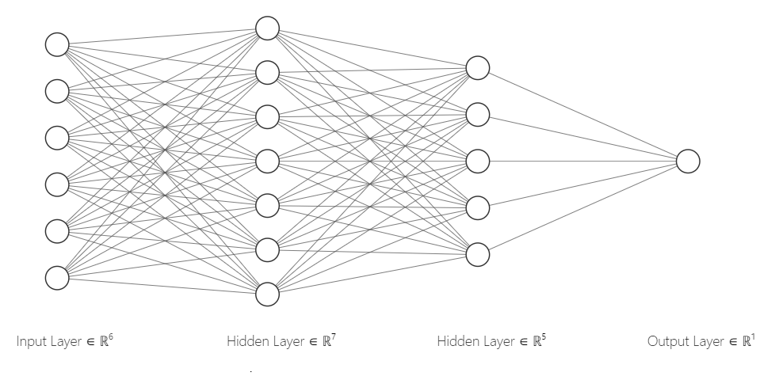
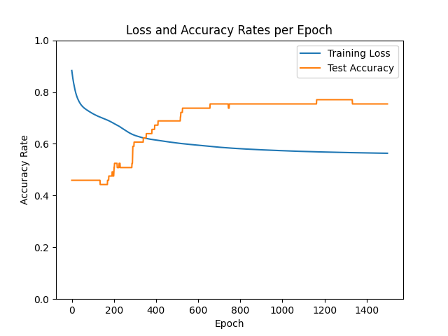

# Heart Disease Prediction with a Multilayer Perceptron (MLP)

This repository contains a Python implementation of a Multilayer Perceptron (MLP) for predicting heart disease using the [Cleveland Heart Disease dataset](https://archive.ics.uci.edu/ml/datasets/heart+disease) from the UCI Machine Learning Repository.

## Project Purpose

This project was created for the purpose of studying and understanding the concepts of machine learning, particularly:

* **Building a Neural Network:**  Understanding how to build a simple neural network with multiple layers.
* **Interpreting Results:**  Analyzing the model's performance and identifying potential areas for improvement.
* **Gradient Descent Optimization:** Implementing and optimizing the learning process using gradient descent.
* **Learning Rate Impact:** Experimenting with different learning rates and analyzing their effect on model performance.
* **Adding Layers:** Incorporating additional layers to enhance the model's learning capacity and generalization.
* **Activation Functions:** Using ReLU and Sigmoid activation functions appropriately in different layers.
* **Epochs Impact:**  Understanding how the number of epochs influences the model's outcome.

## Sources

This project draws inspiration from various sources, including:

* Online courses and tutorials.
* Articles and documentation on machine learning.
* The use of generative AI tools for research and exploration.

## Project Structure

* **train.py:**  This script contains the code for training the MLP model.
* **predict.py:** This script demonstrates how to load a trained model and make predictions using it.

## How to Run the Code

1. **Install Dependencies:**
   ```bash
   pip install tensorflow pandas scikit-learn ucimlrepo matplotlib
   
## Key Features

* **Multilayer Perceptron (MLP):** A neural network with two hidden layers and a sigmoid output layer.
* **Gradient Descent Optimization:** Uses the stochastic gradient descent (SGD) optimizer for training.
* **Performance Metrics:** Tracks training loss and test accuracy over epochs.
* **Model Saving:** Saves the trained weights and biases to a `.npz` file for later use.

## Model Architecture



## Training Results



## Future Improvements

* **Hyperparameter Tuning:** Experiment with different learning rates, hidden layer sizes, and activation functions to find optimal performance.
* **Data Preprocessing:** Explore different data normalization and feature engineering techniques for better results.
* **Regularization:** Implement regularization techniques (e.g., L1 or L2 regularization) to prevent overfitting.
* **Model Evaluation:** Use more comprehensive evaluation metrics, such as precision, recall, and F1-score.

## Contributions

Contributions are welcome! If you have any suggestions or improvements, feel free to open an issue or submit a pull request.
